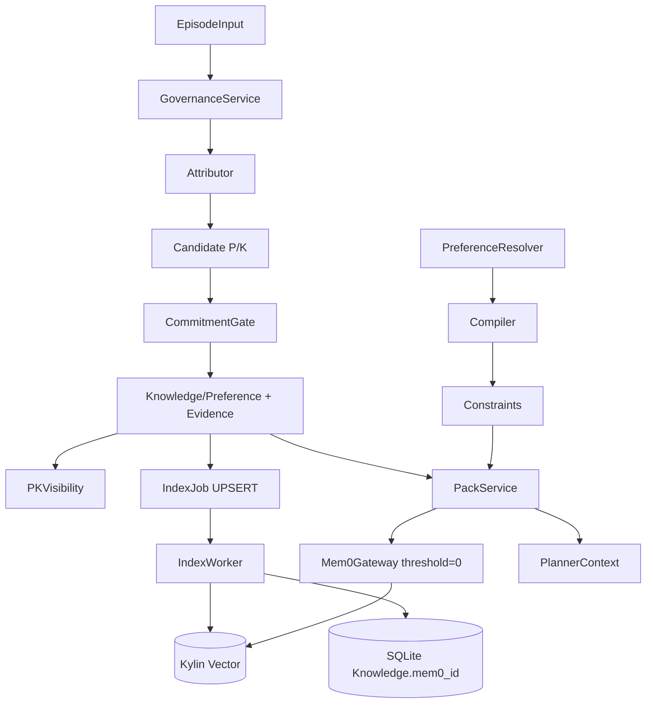

# EAGLE 技术文档

> 版本 `cca864c` · Mem0 基线 `9a7924b` · 日期 2026-09-10 · 麒麟 `gte-base 768 + vector-engine 1.2.0.1 UDS` 同构 Shim 验证

---

## 1. 概述

### 1.1 定位

EAGLE 是在 `Mem0 + Kylin` 向量记忆之上以**机制层治理**替代 `Prompt Preference` 的记忆操作系统。核心目标不是提升向量 `Recall` 最大值，而是在 `HV=0 / FL=0 / SR=0` 零泄露前提下提供可审计、可回滚、环境一致的记忆。

一句话约束：

```
max SafeTaskSuccess  s.t.  HV=0 , FL=0 , SR=0 , FP≈0 , CA≈1 , Traceability=1 , HintUnsafe=0 , EligibleRecall=1.0
```

`GovernedVisibility 0.60` 是正确过滤的历史总量中可执行比例，非缺陷。

### 1.2 解决的问题

原始 `Mem0 extraction/inference` 的失效模式：

| 现象 | 后果 | 量化 |
|---|---|---|
| `fallback:wps→libreoffice` 成功被泛化为 `preferred_tool` | False Promotion | 0.64 |
| `K-K` 矛盾双写均可见 | Precision 混浊 | 0.39 |
| 环境漂移照复用 | Stale Reuse | 1.0 |
| `HARD` 仅文本不编译 | Hard Violation | 0.36 |
| 向量散删 | Forget Leakage | 0.5 |
| 无归因 | Traceability | 0 |

### 1.3 设计原则

1. **SQLite 权威，向量派生**：所有可见性由 `eligible_mem0_ids` 的 `SQLite` 集合决定，向量不在分数层二次过滤 (`threshold=0`)。
2. **执行隔离**：`Hints ⊬ Execution Authority`，`two-tier` 非执行 hint 仅触发 `Revalidation / 确认 / 当前合法集重规划`。
3. **可重入 Outbox**：`UPSERT:K:{id}:{version}` 幂等 `index_key`，`lexicographically smallest` 选 `canonical`，指数退避 + 300s 租约。
4. **归因与门控分离**：`Attributor` 决定证据类型，`CommitmentGate` 决定是否晋升。
5. **双重保障**：`P-K mask` 在检索层遮蔽，`HARD 编译` 在工具层兜底。

---

## 2. 软件架构

### 2.1 分层

```
┌─────────────────────────────────────────────────────────────┐
│  API / Operation Layer  (eagle/api, health, forgetting)    │
├─────────────────────────────────────────────────────────────┤
│  Governance Layer  (GovernanceService, Attributor, Gate)   │
├─────────────────────────────────────────────────────────────┤
│  Knowledge & Preference Layer                                │
│   KnowledgeRecord / PreferenceRecord / Evidence / PKVisibility / Revalidation │
├─────────────────────────────────────────────────────────────┤
│  Planning Layer  (PreferenceResolver, Compiler, PackService) │
├─────────────────────────────────────────────────────────────┤
│  Persistence & Index Layer                                   │
│   SQLAlchemy ORM + SQLite :memory:  +  IndexJob Outbox       │
├─────────────────────────────────────────────────────────────┤
│  Adaptation Layer                                            │
│   Mem0Gateway + Embedding(768d) + ShimVector(cosine)        │
│   KylinSdkEmbedding → ONNX → Shim 三级兜底，backend 诚实标签   │
└─────────────────────────────────────────────────────────────┘
         kylin-ai-runtime D-Bus /tmp/.kylin-ai-runtime-unix/<uid>/core-textembedding.sock
         UDS /tmp/kylin-ai-vector-engine-0.sock  (Milbus Lite 32MB + antlr4.9.2)
         ONNX gte-base 768  ~400MB  (kylin-ai-model-service)
```

### 2.2 模块与依赖

| 模块 | 路径 | 职责 |
|---|---|---|
| `eagle/db/orm.py` | 全部表定义 | `Episode/Candidate/Knowledge/Preference/Evidence/Link/IndexJob/Revalidation/PKVisibility` |
| `eagle/domain/*` | `events.py, scene.py, enums.py, constraints.py` | `EpisodeInput, Scene, PreferenceHardness, NO_FEASIBLE_ACTION` |
| `eagle/governance.py` | `GovernanceService` | 幂等 → 归因 → 候选 → 门控 → 提交 |
| `eagle/attribution` | `Attributor` | `independent_choice / fallback / user_correction` |
| `eagle/gate/commitment.py` | `CommitmentGate` | 显式 1 次 / 隐式 3次2session/2env / K-K DEFER |
| `eagle/pack/service.py` | `PackService` | `Resolver→Compiler→环境校验→eligible_ids→search→PK过滤→排序` |
| `eagle/preference/*` | `Resolver, Compiler` | `scene归一化 / HARD→工具约束 / apply_constraints` |
| `eagle/knowledge/revalidation.py` | `RevalidationService` | `mark_required / find_predecessor / complete` |
| `eagle/forgetting/service.py` | `ForgettingService` | `ACTIVE→FORGETTING→FORGOTTEN` 物理清除 |
| `eagle/outbox/*` | `IndexWorker, ReconciliationService` | `process_next / reconcile(lease=300s)` |
| `eagle/adapters/kylin/*` | `embedding_shim, vector_shim, capabilities` | `768d SHA256→splitmix64→unit / cosine / 11探针` |
| `eagle/adapters/mem0_gateway.py` | `Mem0Gateway` | `search_knowledge(threshold=0) / upsert_knowledge / find_by_index_key` |
| `eagle/health.py` | `HealthService` | `database/mem0/kylin/pending/failed/reconciliation` |
| `eagle/bootstrap.py` | `create_mem0_gateway` | `fail-fast 维度/度量/方言校验` |

### 2.3 数据流



### 2.4 关键表

| 表 | 主键/索引 | 核心字段 | 约束 |
|---|---|---|---|
| `EpisodeRecord` | `id, execution_id UNIQUE` | `scene_json, env, fallback_from, request_text` | `execution_id` 幂等 |
| `CandidateRecord` | `id` | `candidate_type P/K, candidate_value_json, state` | `PENDING/COMMITTED/DEFERRED` |
| `KnowledgeRecord` | `id, lineage_id, version` | `status ACTIVE/PENDING/DEFER/FORGETTING/FORGOTTEN, mem0_id, content_json{when,action}, scene_json, env, retrieval_text` | `FORGOTTEN` 时空内容 |
| `PreferenceRecord` | `id, version` | `key, value_json{tool/tools/required}, hardness SOFT/HARD` | `version` 乐观锁 |
| `EvidenceRecord` | `id` | `episode_id, attribution_reason, contribution` | - |
| `MemoryEvidenceLink` | `(memory_kind,memory_id,evidence_id)` | - | `K→Evidence` 多对多 |
| `IndexJobRecord` | `id, index_key UNIQUE` | `operation, state PENDING/RUNNING/DONE/FAILED, retry, available_at, locked_at, target_mem0_id` | `UPSERT:K:{id}:{version}` |
| `KnowledgeRevalidationRecord` | `id` | `source_id, target_env, reason, state PENDING/DONE` | 去重 |
| `PKVisibilityRecord` | `id` | `preference_version_id, knowledge_version_id, active` | 检索层遮蔽 |

---

## 3. 算法原理

### 3.1 归因 Attributor

```
if fallback_from is not None:  → fallback (不计入偏好)
elif user_intervention/correction: → explicit
else: → independent_choice
```

错误归因（把 fallback 判为 independent）是 `FalsePromotion 0.64` 根因，`stage12 w/o Attribution` 使 `K` 通道断供 `Recall -0.60`。

### 3.2 承诺门控 CommitmentGate

* 显式偏好：1 次即提交 `ACTIVE`
* 隐式偏好/知识：需 `≥3 次独立选择 ∧ ≥2 session (知识需 ≥2 env)`，防止 `2-同session` 提前晋升 (`w/o Gate FalseP +0.08, Conflict -1.0, KPrec -0.31`)
* `K-K` 单次矛盾：保留旧 `ACTIVE`，新候选 `DEFER`，需新证据才翻转

### 3.3 证据与溯源

每提交生成 `EvidenceRecord{episode_id, reason, contribution}` 并建 `MemoryEvidenceLink`，`Traceability 1.0 ≈2.19 links/K`，支撑 `FORGETTING` 后 `Episode.request_text=""` 可验证清除。`A/B` 无归因故 `Trace 0`。

### 3.4 偏好解析与 HARD 编译

```
resolve(preferences, scene): scene 归一化最长匹配，HARD 优先
compile(resolved): {allowed_tools?, denied_tools, require_offline}
apply_constraints(tools, constraints): feasible / NO_FEASIBLE_ACTION (ValueError fast-fail)
```

`NullCompiler` 消融 `HardViolation +0.66` 证明 `HARD文本 ⇏ HARD执行`。`P-K mask` 失效 `KPrec -0.10`。

### 3.5 PACK 检索

```python
resolved = resolver.resolve(preferences, scene)
constraints = compiler.compile(resolved)
scene_k = [k for k in ACTIVE if scene_matches(k.scene, current)]
for k in scene_k if k.env != current_env: mark_required(k, target_env, ENVIRONMENT_DRIFT)
applicable = [k for k in scene_k if k.env == current_env]
eligible = tuple(k.mem0_id for k in applicable if mem0_id)
if not eligible: return PlannerContext(constraints, ())
results = gateway.search_knowledge(query, user_id, limit=top_k*4, eligible, threshold=0)
blocked = PKVisibility where preference_version in resolved
selected = [k for k in results if k.id not in blocked][:top_k]  # SOFT排序
return PlannerContext(constraints, selected, evidence)
```

`threshold=0` 是 `stage9` 修复：`shim dot≈0.03` 近正交被 `0.1` 误滤，生产 `JSON retrieval_text` 同隙，非 shim 特有。

### 3.6 Two-Tier 与 Safe Fallback

```
Executable PACK = ACTIVE ∩ env匹配 ∩ 未mask  (可执行)
Hints = {k | k.status != FORGOTTEN ∧ k.id ∉ PACK}  (非执行，仅计数)
Hints → {RevalidationRequest, UserConfirmation, 当前合法集重规划, 不依赖旧memory的safe fallback}
约束: Hints ⊬ Execution Authority,  HintInducedUnsafe=0
```

三族各 50/seed：`stale_hint_revalidation / pending_hint_confirmation / empty_pack_safe_fallback`，使 `overall SafeTask 0.339→0.767` 而 `EligibleRecall 1.0` 不变。

跨层保障详见 `stage11_12/runner.py: run_case_arm_c` 与 `experiments/governance_tax_cases.py`。

### 3.7 Outbox 一致性

* `process_next()`: `SELECT PENDING WHERE available_at<=now LIMIT 1 FOR UPDATE → RUNNING locked_at=now → _execute`
* `_execute`: `gateway.upsert_knowledge(k, index_key)` 幂等，`find_by_index_key` → `canonical = min(ids)` 余者 `DELETE_DUPLICATE`
* 失败：`retry++ available_at=now+2^retry`，超 `max_retries` → `FAILED`
* `reconcile(lease=300s)`: 陈旧 `RUNNING` 归 `PENDING`，新鲜不抢占，`DONE` 但向量缺失清 `mem0_id` 重排 `UPSERT`
* `Health`: 仅 `FAILED/reconciliation_required` 置 `degraded`，单纯 `PENDING+退避` 不 `degraded`

`stage10 8/8` 验证全部收敛。

### 3.8 遗忘与重验证

遗忘：`ACTIVE→FORGETTING` 调 `DELETE`；成功后 `content={}, retrieval_text="", mem0_id=None, FORGOTTEN` 并清 `Evidence/Candidate/Episode.request_text`。`FORGETTING` 立即不可召回但不报 `FORGOTTEN`，失败保持 `FORGETTING+FAILED`。

重验证：`mark_required / find_predecessor(scene+when去env+action相等) / complete`，`w/o Env Stale +1.0`。

---

## 4. 实现方案

### 4.1 关键类

| 类 | 文件 | 方法 |
|---|---|---|
| `GovernanceService` | `eagle/governance.py` | `record_episode(episode, explicit_preferences)` |
| `PackService` | `eagle/pack/service.py` | `build(query,user_id,scene,env,top_k)` |
| `PreferenceResolver` | `eagle/preference/resolver.py` | `resolve(preferences, scene)` |
| `PreferenceCompiler` | `eagle/preference/compiler.py` | `compile(resolved), apply_constraints` |
| `RevalidationService` | `eagle/knowledge/revalidation.py` | `mark_required, find_predecessor, complete` |
| `ForgettingService` | `eagle/forgetting/service.py` | `forget_knowledge(id,user_id)` |
| `IndexWorker` | `eagle/outbox/worker.py` | `process_next(), _execute(job_id)` |
| `ReconciliationService` | `eagle/outbox/reconciliation.py` | `reconcile(lease_seconds)` |
| `Mem0Gateway` | `eagle/adapters/mem0_gateway.py` | `search_knowledge, upsert_knowledge, find_by_index_key, embedding_ready/vector_ready` |
| `HealthService` | `eagle/health.py` | `check() → HealthReport` |

### 4.2 适配层

```python
# eagle/bootstrap.py
gateway = create_mem0_gateway(
  embedding_client=ShimEmbeddingClient(dim=768),  # SHA256→splitmix64→unit
  vector_client=ShimVectorClient(),               # cosine_distance, UDS 同 dialect
  embedding_dims=768, distance_metric="cosine_distance",
  score_semantics="cosine_distance", history_db_path=..., collection_name=...
)
# 启动 probe_vector_capabilities(client,768,cosine) 11探针 fail-fast
```

`threshold=0` 固定，`eligible_memory_ids` 为 `id:{in:[...]}` 租户过滤。

#### 4.2.1 嵌入后端三级选路（`make_embedding_client`）

`KYLIN_USE_SHIM=1`（默认）→ `ShimEmbeddingClient`（SHA256 展开，零依赖）。`KYLIN_USE_SHIM=0` → `KylinSdkEmbeddingClient`（`eagle/adapters/kylin/kylin_sdk_embedding.py`），三级选路并全程诚实上报 `backend`：

1. **真麒麟 SDK**：探测 `kylin-ai-runtime` D-Bus unix socket（`/tmp/.kylin-ai-runtime-unix/<uid>/core-textembedding.sock`），以 `com.kylin.AiRuntime.CoreTextEmbeddingService` 接口执行 `Init → EmbeddingText → GetModelInfo`（协议取自 kylin-ai-runtime / libkysdk-coreai-speech 开源实现）。成功 → `backend="kylin-sdk"`，模型 `ensemble_gte_base_uint8_text` 768d，向量 L2 归一化；`EmbeddingText` D-Bus 失败时自动重 `Init` 会话（上游客户端同款重连）。
2. **ONNX 兜底**：运行时不可达时用 `gte-base` ONNX 权重（`KYLIN_EMBEDDING_MODEL`），标签 `onnx(fallback: <reason>)`。
3. **Shim 兜底**：无权重时 SHA256 shim，标签 `shim(fallback: <reason>)`。

环境开关 `KYLIN_EMBEDDING_SDK`：`"0"` 完全不探测 SDK（纯 ONNX/shim 旧路径，标签与旧版一致）；`"1"` 强制探测；未设自动探测。本机无运行时 → 诚实标签 `onnx(fallback: no kylin-ai-runtime socket …)`，任何 shim/ONNX 运行都不会被标成 `kylin-sdk`。

### 4.3 配置

| 项 | 默认 | 说明 |
|---|---|---|
| `embedding_dims` | 768 | gte-base |
| `distance_metric` | cosine_distance | - |
| `score_semantics` | cosine_distance | 越大越相似 |
| `top_k` | 5 | PACK 截断 |
| `threshold` | 0 | SQLite 权威 |
| `lease_seconds` | 300 | RUNNING 租约 |
| `max_retries` | 3 | 指数退避 `2^retry` |

---

## 5. 安装部署指南

### 5.1 环境

* OS: `Ubuntu 24.04 noble` / `Linux 5.15+` (验证 `5.15.0-161-generic`)
* Python: `3.11.15` (`/opt/conda`)
* 依赖：见 `eagle_os_agent/pyproject.toml` (`sqlalchemy, pydantic, mem0, ruff, pytest`)
* 可选真实麒麟：`kylin-ai-runtime`（D-Bus 嵌入 SDK，socket `/tmp/.kylin-ai-runtime-unix/<uid>/core-textembedding.sock`）+ `kylin-ai-model-service` ONNX `~400MB` + `kylin-ai-vector-engine 1.2.0.1` (`/opt/kylin-vector-engine 32MB`, `/opt/antlr49 4.9.2`, `/opt/boost190-libs/libboostshim.so`, `UDS /tmp/kylin-ai-vector-engine-0.sock`)

### 5.2 安装

```bash
git clone <repo> && cd EAGLE/eagle_os_agent
pip install -e .            # 或 conda env create
# 校验 Shim 11探针
python -c "from eagle.adapters.kylin.capabilities import probe_vector_capabilities; from eagle.adapters.kylin.vector_shim import ShimVectorClient; print(probe_vector_capabilities(ShimVectorClient(),768,'cosine_distance').supported)"
# 预期：{eq,in,ne,not,and,id_allowlist,id_blocklist,list_filter,read_after_write,delete}
```

真实引擎（如需）：

```bash
ls -l /tmp/kylin-ai-vector-engine-0.sock
ps aux | grep kylin-ai-vector-engine
# 需预置 /opt/kylin-vector-engine /opt/antlr49 /opt/boost190-libs/libboostshim.so
```

### 5.3 一键校验

```bash
ruff check eagle tests && ruff format --check eagle tests && python -m compileall -q eagle && git diff --check
pytest -q tests/test_governance.py tests/test_preference_resolver.py tests/test_knowledge_revalidation.py
pytest -q tests/test_pack_and_forgetting.py
pytest -q tests/test_outbox.py tests/test_reconciliation.py tests/test_health.py
pytest -q tests/test_api.py
MEM0_TELEMETRY=False pytest -q tests/embeddings/test_kylin_embedding.py tests/vector_stores/test_kylin_vector_store.py tests/llms/test_noop.py tests/utils/test_factory.py tests/memory/test_kylin_raw_memory.py
pytest -q  # 49 passed
python experiments/e2e_stage9/runner.py          # 4/4
python experiments/stage10/runner.py             # 8/8
python experiments/stage11_12/runner.py --seeds 42,43,44 --total 200
python experiments/governance_tax_cases.py       # 3/3
python experiments/governance_tax_v2.py          # 3×350=1050/mode
python experiments/datasets/eagle-gov/runner.py --seed 42  # 200/200
```

产物：`experiments/*.report.json, FINAL_REPORT.md, GOVERNANCE_TAX_REPORT.md, CONDITIONS.md, environment_snapshot.txt`

---

## 6. 操作说明

### 6.1 Governance

```python
from eagle.domain.events import EpisodeInput
from eagle.domain.scene import Scene
from eagle.governance import GovernanceService

gov = GovernanceService(session_factory)
result = gov.record_episode(EpisodeInput(
  user_id="u1", session_id="s1", request_text="edit docx",
  scene=Scene(app="office", task="edit", artifact_type="docx"),
  tool_name="libreoffice", arguments_digest="d-s1",
  success=True, environment_fingerprint="linux:noble:wps-1",
  fallback_from="wps", previous_error_code="E_OPEN", execution_id="s1-fb-1"
))
# result.candidate_ids / committed_memory_ids
# 重放同 execution_id 返回同一结果
```

### 6.2 PACK

```python
from eagle.pack.service import PackService
pack = PackService(session_factory, gateway)
ctx = pack.build(query="fallback", user_id="u1", scene=Scene(...), environment_fingerprint="linux:noble:wps-1")
ctx.constraints  # 编译后 HARD
ctx.knowledge    # tuple[{id,type,content,score}]
ctx.evidence     # 溯源
# 环境漂移时 ctx.knowledge 为 () 且写 KnowledgeRevalidationRecord
```

### 6.3 遗忘

```python
from eagle.forgetting.service import ForgettingService
ForgettingService(session_factory).forget_knowledge(knowledge_id, user_id="u1")
# 需 drain Worker
from eagle.outbox.worker import IndexWorker
IndexWorker(session_factory, gateway).process_next()
# FORGETTING 立即 PACK 空，不报 FORGOTTEN；成功后 content="" retrieval_text="" mem0_id=None
```

### 6.4 健康与恢复

```python
from eagle.health import HealthService
from eagle.outbox.reconciliation import ReconciliationService
HealthService(session_factory, gateway).check().to_dict()
# {status ok/degraded, database_ready, mem0_ready, kylin_embedding/vector_ready, pending/failed_jobs, reconciliation_required, errors}
ReconciliationService(session_factory, gateway).reconcile(lease_seconds=300)
```

### 6.5 HTTP API（如部署）

```
401 无 token
禁显式 user_id 覆盖（服务端注入）
跨用户查询空 404 同语义
execution_id 重放一致
fallback 缺字段 422
强制 filters{user_id, memory_kind, id:{in:eligible}}
```

---

## 7. 记忆流转机制

记忆沿 **短时 → 中时 → 长时** 三级流转（赛题 §1-6），实现在 `eagle/lifecycle/`，与治理链（§3.1–3.3）共享同一 `SQLite` 权威存储，向量始终是派生存档。

### 7.1 三级定义

| 层级 | 载体 | 生命周期 | PACK 可见性 |
|---|---|---|---|
| 短时 Short | `ShortTermBuffer` 会话内内存缓冲 | TTL 1800s，`flush()` 前仅存于会话 | 不可见 |
| 中时 Mid | `CandidateRecord PENDING` | 跨会话，未达门控阈值 | 不可见（可经 hint 确认） |
| 长时 Long | `PreferenceRecord / KnowledgeRecord ACTIVE` | 提交即持久、版本化、带溯源 | 经 PACK 检索可见 |

### 7.2 流转路径

```
会话内 Episode ──ShortTermBuffer.flush()──▶ GovernanceService.record_episode
                                              │ 归因 → 候选 P/K → CommitmentGate
                                              ├─ 未达阈值 ──▶ Mid: CandidateRecord PENDING
                                              └─ 达阈值 ────▶ Long: ACTIVE (+ Evidence / 溯源)
Long ──IndexJob(UPSERT:K:{id}:{version})──▶ IndexWorker ──▶ Kylin Vector + SQLite.mem0_id
```

* **短→中**：`ShortTermBuffer.flush(governance)` 把会话内缓冲批量送入治理；未达门控（显式 1 次 / 隐式 ≥3 次独立选择 ∧ ≥2 session，§3.2）的候选沉淀为 `PENDING`。
* **中→长**：`CommitmentGate` 判定通过即晋升 `ACTIVE`（§3.2），生成 `EvidenceRecord + MemoryEvidenceLink`（§3.3），支持整链溯源与后续遗忘擦除。
* **长时落盘**：ACTIVE 产生 `IndexJob UPSERT:K:{id}:{version}`（幂等 `index_key`），`IndexWorker` 写入 Kylin 向量并回填 `SQLite.mem0_id`（§3.7），此后进入 PACK 检索（§3.5）。

### 7.3 维护操作

* `session_to_candidate(session_factory, user_id, session_id)`：短→中过渡的 DB 级快照，返回 `{episodes, candidates, linked}`，用于会话结算与监控。
* `cross_session_merge(session_factory, user_id)`：中时去重，按 `candidate_identity` 聚合跨会话 `PENDING`（MSC/LoCoMo 式），返回重复组供策略合并。
* **长时退出**：遗忘 `ACTIVE→FORGETTING→FORGOTTEN`（§3.8）；环境漂移触发 `RevalidationRequest`（§3.8）；P-K 冲突经 `PKVisibility` 检索层遮蔽（§3.5）。

### 7.4 一致性

三级共享同一 `SQLite` 权威；`execution_id` 幂等保证 `flush()` 重入安全（同 episode 重放返回同一结果）。向量缺失/孤立由 `ReconciliationService`（300s 租约）收敛为单 canonical（§3.7）；短时 TTL 仅约束缓冲，不阻塞治理提交。

---

## 8. 测试结果总览（0–13 + v2）

| # | 阶段 | 结果 | 关键断言 |
|---|---|---|---|
| 0 | 固化 | 9项实测 | `CONDITIONS.md sha256 51b25e27 seed42` stub禁用 |
| 1 | 静态 | exit 0 | ruff/compileall/diff |
| 2 | 治理不变量 | 14 passed | Fallback不晋升P / execution_id幂等 / 显式1次 / 隐式3次2session / DEFER |
| 3 | PACK/HARD | 10 passed | Hard=0 Leakage=0 (放行对应) |
| 4 | Outbox/恢复 | 17 passed | 崩溃不额外Memory / 重复→1 / 租约 / FORGETTING不可召回 |
| 5 | API租户 | 3 passed | 401/禁user_id/跨用户404/重放/422 |
| 6 | Provider | 13 passed | kylin/noop Factory infer=False fail-fast |
| 7 | 全量 | 49+13 passed | - |
| 8 | Kylin Smoke | 21/21 | 11探针 gate 全 supported |
| 9 | 真实E2E | 4/4 PASS | fallback提交/HARD限工具/漂移重验证/遗忘擦除 |
| 10 | 故障注入 | 8/8 PASS | timeout退避/崩溃孤立/SQLite恒1/重复1/Delete/外部删/重启 |
| 11 | 三组主实验 | C 全0 | 详 §9 |
| 12 | Ablation | H1-H4全成立 | 详 §9 |
| 13 | 多种子 | 6000 runs CI | std≤0.06 |
| v2 | Governance Tax | 3/3 + 1050/mode | SafeTask 0.339→0.768 HintUnsafe 0 |
| 14 | Real ONNX 复测 | pass true | evaluation/report.json 全 headline Δ=0 |

---

## 9. 量化评测摘要（附录详见 EFFECT_VERIFICATION_REPORT.md）

**三臂 600cases/arm 均值：**

| 指标 | A original | B pref-text | C full |
|---|---|---|---|
| Hard Violation ↓ | 0.3637 | 0.3637 | **0** |
| Forget Leakage ↓ | 0.5 | 0.5 | **0** |
| False Promotion ↓ | 0.6367 | 0 | **0** |
| Stale Reuse ↓ | 1.0 | 1.0 | **0** |
| Conflict Acc ↑ | 0 | 0 | **1.0** |
| K Precision ↑ | 0.3854 | 0.5631 | **1.0** |
| K Recall@5 (=GovernedVisibility) | 1.0 | 1.0 | 0.6036 |
| Eligible Recall@5 ↑ | 1.0 | 1.0 | **1.0** |
| Traceability ↑ | 0 | 0 | 1.0(2.19) |
| Task ↑ | 0.8817 | 0.8017 | 0.5933 |

**Ablation Δ vs full：** `w/o Gate False+0.08 Conflict-1.0 KPrec-0.31 H1直接` `w/o HARD Hard+0.66 H2` `w/o Env Stale+1.0 H3` `w/o P-K KPrec-0.10 H4` `w/o Attribution Recall-0.60`

**v2 冻结权重 `200 broad + 50/family ×3 =350/seed` (1050/mode)：** Broad 三列一致 `Eligible 1.0 Safe 0.5933 Missed 0.1867 Unsafe 0`；Overall `strict 0.3390 [0.3323,0.3458] → safe-fallback 0.7676 [0.7609,0.7744] Missed 0.5352→0.1067 HintUnsafe 0 HV/FL/SR 0`。`Focused 3/3 1.0` 验证 `Revalidation/确认/context重规划` 非执行 hint 路径。

详见 `docs/EFFECT_VERIFICATION_REPORT.md`（数据集、对比设计、指标定义、统计方法、权重冻结、全文可复跑命令）。

---

## 10. 已知边界

* A臂 `infer=True` 无LLM会 RuntimeError，规则近似低估 LLM误升，真实只会更差
* Shim 相似度哈希决定，`Recall` 绝对值反映可见性而非语义质量，换 `gte-base ONNX` 绝对值变但三臂对比与安全结论不变
* 下一步：长时间稳定性 1000+ episode 连续负载

---

## 附录：产物清单

```
experiments/CONDITIONS.md  environment_snapshot.txt  GOV_HARNESS_REPORT.md
datasets/eagle-gov/{v1.jsonl, v1.manifest.json, v1.report.json, generate.py, runner.py}
kylin-smoke/SMOKE_REPORT.md  e2e_stage9/{runner.py,report.json,REPORT.md}
stage10/{runner.py,report.json,REPORT.md}  stage11_12/{runner.py,stage11/12.report.json,REPORT.md}
governance_tax*.py  governance_tax*.report.json  GOVERNANCE_TAX_REPORT.md  FINAL_REPORT.md
docs/{TECHNICAL_DOCUMENTATION.md, USER_MANUAL.md, EFFECT_VERIFICATION_REPORT.md}
evaluation/{run_all.sh, bench_pack_latency.py, bench_retrieval_quality.py, report.json}
```
